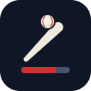
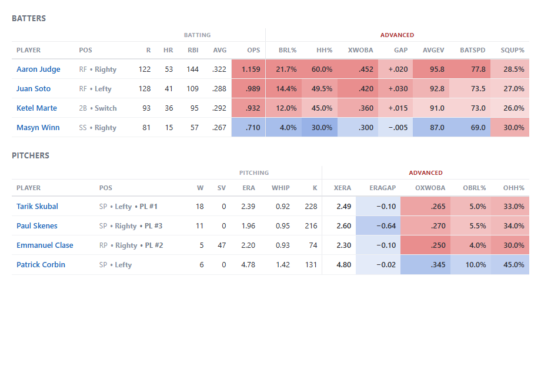
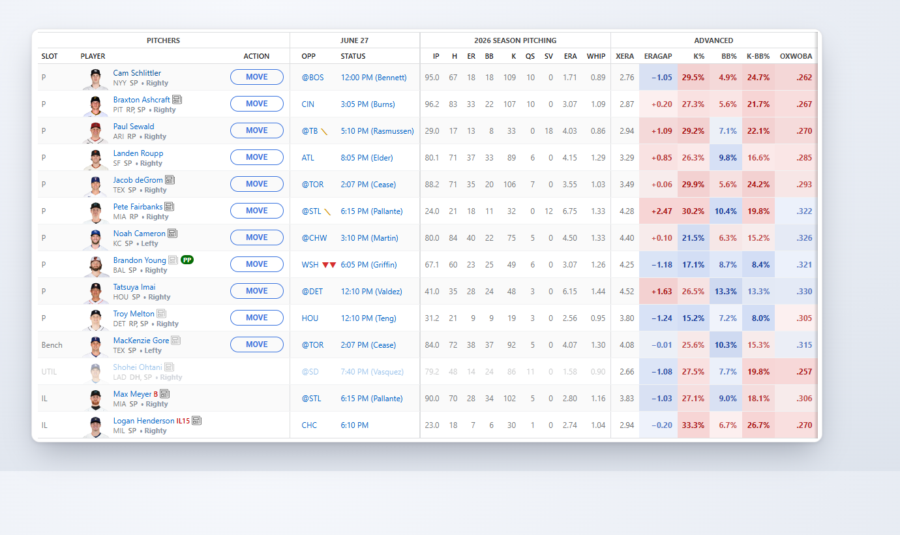
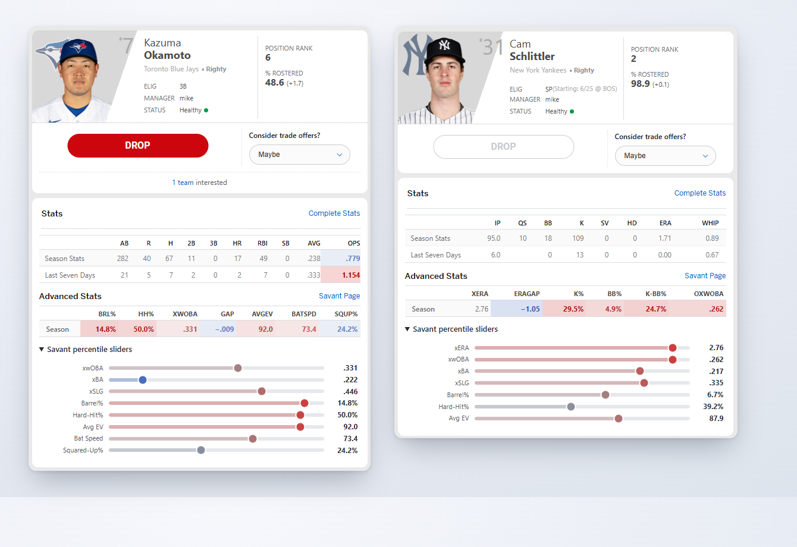
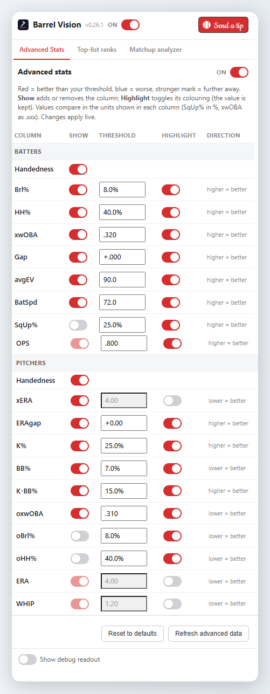
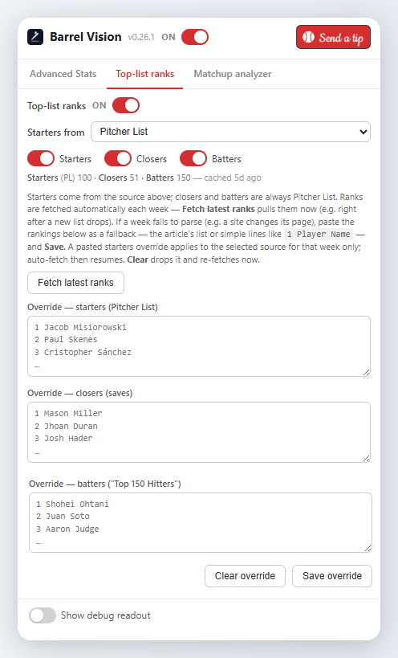
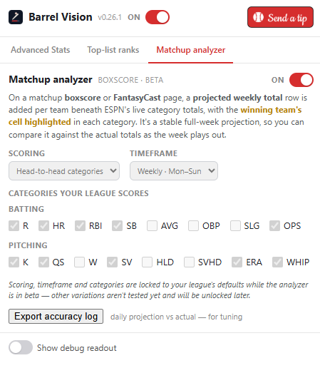
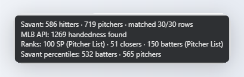
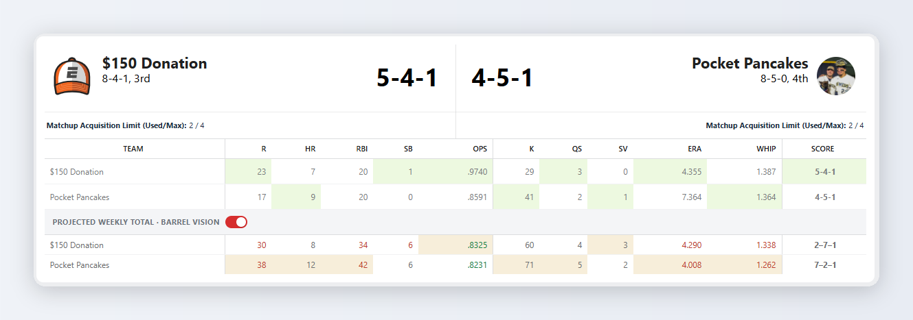

<h1 align="center">
  &nbsp; Barrel Vision
</h1>

<!-- When published, point the three store badges at their listing URLs and swap the grey "coming soon"
     for a brand colour (e.g. ?logo=googlechrome and a real https link). -->

  
  
  
  
  

A Chrome and Edge extension that puts **Baseball Savant contact-quality metrics**, **batter and pitcher
handedness**, **weekly top-list ranks**, and **matchup analysis** right on your ESPN Fantasy Baseball
pages — inline with ESPN's own stats on roster lists, in the player card, and on the matchup boxscore.
No more tab-switching to read a player or size up a week.

> **Beta** · Barrel Vision works and is in active use, but it's still under development and is **not yet
> published** to the Chrome, Edge, or Firefox stores — for now, [install it unpacked](#install). The
> advanced-stats overlay works on any ESPN Fantasy Baseball roster; the **matchup analyzer** is currently
> tuned to a standard **10-category weekly head-to-head** league (R/HR/RBI/SB/OPS · K/QS/SV/ERA/WHIP,
> Mon–Sun), with other formats unlocking as they're tested.

---

## What it looks like

Savant's advanced columns land next to ESPN's own stats, with the numbers tinted so the read is instant:
🟥 **red** = better than your threshold, 🟦 **blue** = worse, and a stronger tint means further from it.
Each player also picks up handedness, weekly top-list ranks, and a day-of matchup rating (▲▲…▼▼).

Pitchers get their own column set (**xERA**, **ERAgap**, **K%** / **BB%** / **K−BB%**, and opponent contact
quality), with the matchup symbol appearing on a starter's game day.

Open a player card and the same metrics appear as a native-looking **Advanced Stats** table, plus a
collapsible **Savant percentile sliders** panel (the real value at each percentile, like Savant's own page)
and a link to the player's Savant page, for batters and pitchers alike.

---

## The toolbar popup

Everything is controlled from the **toolbar popup**, organised into three tabs — one per feature. A master
switch turns the whole extension on or off, and every change applies live, with no page reload.

**Advanced Stats** — per-column **Show** and **Highlight** toggles with your own thresholds and direction
(*higher / lower = better*), split into **BATTERS** and **PITCHERS** column sets. **Refresh advanced data**
re-pulls from Savant; **Reset to defaults** restores the stock thresholds.

**Top-list ranks** — choose where **starting-pitcher** ranks come from (**Pitcher List**, **Razzball**, or
**RotoBaller**); closer and hitter ranks always come from Pitcher List. Toggle each list on its own, see a
per-list health line (rows parsed and when they were last cached), **Fetch latest ranks** on demand, or paste
a manual override for a week if a site changes its page.

**Matchup analyzer** — switch the boxscore projections on or off and see which **scoring, timeframe, and
categories** are in play. These are locked to a standard 10-category weekly league while the analyzer is in
beta; **Export accuracy log** copies the daily projection-vs-actual history out for tuning.

Flip **Show debug readout** at the bottom of any tab for a one-line data-health HUD — how many Savant
hitters/pitchers loaded, rows matched on the current page, handedness records found, and which rank lists are
cached. Handy when a value looks off.

---

## Matchup analyzer

On a matchup **boxscore** or **FantasyCast** page, Barrel Vision adds a **projected weekly total** row
beneath each team's live category totals — a stable full-week projection with the **winning team's cell
highlighted** in every category. Compare it against the live totals as the week plays out to see who's
favored and which categories are still winnable.

---

## What it shows

**Batters:** **barrel%**, **hard-hit%**, **xwOBA**, the **xwOBA−wOBA gap**, **avg EV**, **bat speed**, **squared-up%**.

**Pitchers:** **xERA**, the **ERA−xERA gap**, **K%**, **BB%**, **K−BB%**, **opponent xwOBA**, **opponent barrel%**, **opponent hard-hit%**.

On top of the columns it also:

- Tints ESPN's own **OPS**, **ERA**, and **WHIP** with the same threshold colouring.
- Adds **batter and pitcher handedness** next to each player ("Milwaukee Brewers • Righty").
- Adds **day-of matchup ratings** in the opponent column: a ▲▲…▼▼ symbol (🟩 **green** = good matchup,
  🟥 **red** = tough) from the batter's platoon edge versus the listed starter, or the park-adjusted
  opponent offense for pitchers.
- Shows **weekly top-list ranks** beside each player (e.g. "• PL #4"). Starting-pitcher ranks come from your
  choice of **Pitcher List**, **Razzball**, or **RotoBaller**; closer and hitter ranks come from Pitcher List.
- Projects the **full-week matchup** on the boxscore / FantasyCast, highlighting the projected category
  winners (see [Matchup analyzer](#matchup-analyzer) above).
- In the player card, condenses ESPN's columns (**OBP**+**SLG** into **OPS**, **W**+**L** into **QS**,
  computed as the true season Quality Starts) and adds the **Advanced Stats** table and **percentile sliders**.
- Can be turned **off entirely** from the popup switch or a right-click on the toolbar icon. The overlay
  disappears live and nothing is fetched while it's off.

Players are matched by name, so there's no setup. Unmatched players just show blank cells.

---

## Install

Once Barrel Vision is published you'll install it straight from the **Chrome Web Store**, **Edge Add-ons**,
or **Firefox Add-ons** (badges above). Until then, load it unpacked:

1. Download or clone this repo.
2. Open `chrome://extensions` (or `edge://extensions`) and turn on **Developer mode**.
3. Click **Load unpacked** and select the **`src/`** folder.
4. Open a `fantasy.espn.com/baseball/…` roster. The metric columns appear next to ESPN's stats; set your
   thresholds from the toolbar popup.

---

## Privacy

Barrel Vision only reads player names from the page and fetches **public** baseball data (Baseball Savant,
the MLB StatsAPI, and the weekly rank sites). It has **no host access to ESPN**, no analytics, no remote
code, and no backend. Nothing from your ESPN session is read or sent anywhere. Full details in
[PRIVACY.md](PRIVACY.md).

---

## Roadmap

Barrel Vision runs today on **ESPN Fantasy Baseball** in Chrome and Edge. Planned next:

- **More fantasy platforms:** Yahoo Fantasy, Sleeper, CBS Sports, and Fantrax.
- **More league formats in the matchup analyzer:** rotisserie, head-to-head points, daily, and custom
  category sets (it's locked to a standard 10-category weekly league for now).
- **More browsers and store listings:** Chrome Web Store, Edge Add-ons, and Firefox Add-ons.

---

## License

[MIT](LICENSE) © Michael Beardsley. Not affiliated with ESPN, MLB, Pitcher List, Razzball, or RotoBaller.
"Baseball Savant" and "Statcast" are properties of MLB Advanced Media.
