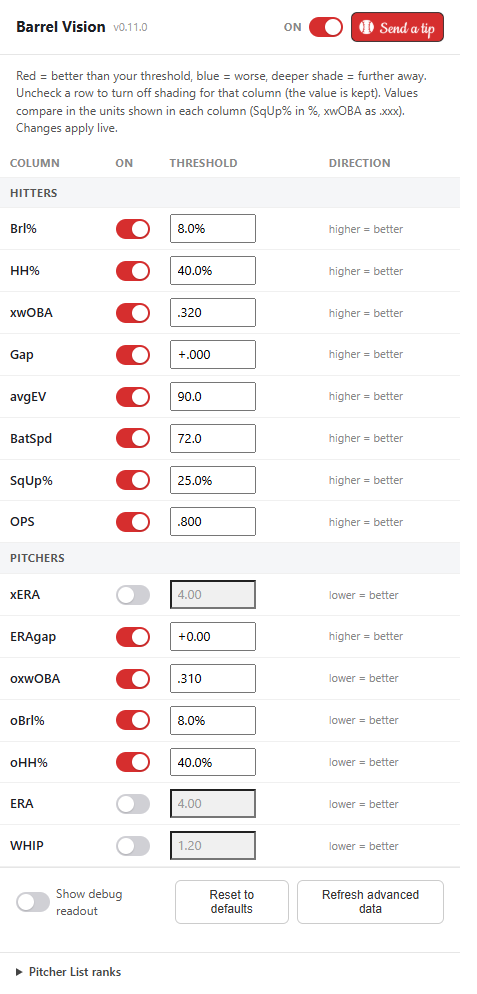

# Barrel Vision

A lightweight Chrome/Edge extension that overlays **Baseball Savant contact-quality metrics** directly
onto **ESPN Fantasy Baseball** — inline with ESPN's own stats, on roster/list views and in the
player-card popup. No more tab-switching to Savant to read a player.

Built as a **buildless, vanilla Manifest V3** extension (no framework, no bundler) — fully auditable,
which matters because it runs on an authenticated ESPN session. It is a faithful port of a working
Tampermonkey userscript (kept in [`userscript/`](userscript/) as the origin artifact).

> Scope: a *lightweight overlay*, not an analytics warehouse. It surfaces current-season metrics next
> to players. The deeper evaluation framework these metrics serve lives in
> [`docs/fantasy_baseball_standards.md`](docs/fantasy_baseball_standards.md).

---

## What it looks like

Savant's contact-quality columns land right next to ESPN's own stats, shaded so the read is instant —
**red = better than your threshold, blue = worse,** deeper shade = further from it. Handedness and
Pitcher List weekly ranks ride along after each pitcher's position.


Open a player card and the same metrics appear as a native-looking **Advanced Stats** table, with
ESPN's own columns condensed (OBP+SLG → OPS for hitters, W+L → QS for pitchers) and a link straight to
the player's Savant page.


Everything is driven from the **toolbar popup** — per-column thresholds, a master on/off switch, and a
weekly Pitcher List refresh. Changes apply live, with no page reload.

<p align="center">
  
</p>

---

## What it shows

**Hitters:** barrel%, hard-hit%, xwOBA, the **xwOBA−wOBA gap** (derived), avg EV, bat speed, squared-up%.
**Pitchers:** xERA, the **ERA−xERA gap** (derived), opponent xwOBA, opponent barrel%, opponent hard-hit%.

It also:
- **Shades** ESPN's own OPS (hitters) and ERA/WHIP (pitchers) with the same threshold gradient.
- Adds **batting/throwing handedness** from the MLB StatsAPI ("Milwaukee Brewers • Righty").
- Surfaces **Pitcher List weekly ranks** inline after a pitcher's handedness as **"• PL #N"** — SP rank
  from "The List" (Top 100) or closer rank from the reliever ranks, with the source list + tier in the
  tooltip. In the player card the badge links to the player's Pitcher List page.
- In the player card, **condenses** columns (OBP+SLG → OPS, W+L → QS) and adds an **Advanced Stats**
  table plus a **Savant Page** link. **QS (Quality Starts)** is computed from the pitcher's StatsAPI
  game log (≥6 IP & ≤3 ER per start), so it's the true season value — not whatever ESPN's stat-filter
  window happens to show.
- Highlights every metric cell: **red = better than your threshold, blue = worse**, deeper shade =
  further from the threshold.
- Can be turned off entirely from a **master switch** (popup) or a **right-click toggle** on the toolbar
  icon — the overlay tears down live (no reload), and while off it fetches nothing.

Players are joined by **normalized name** (accents/suffixes/punctuation stripped), so there's no
external ID crosswalk to maintain. Unmatched players show blank cells.

---

## Install (developer / unpacked)

This is buildless — there is nothing to compile.

1. Clone or download this repo.
2. Open `chrome://extensions` (or `edge://extensions`) and enable **Developer mode** (top right).
3. Click **Load unpacked** and select the **`src/`** folder (the extension root — `manifest.json` lives
   there).
4. Visit `https://fantasy.espn.com/baseball/…` and open your team/roster. The metric columns appear in
   the scrolling stats panel.

Set your highlight thresholds from the **toolbar popup** (click the Barrel Vision icon). Changes apply
live — no reload.

> Toolbar icon: the manifest ships **without** an `icons` block so it loads cleanly with Chrome's
> default icon. To add a designed icon, drop PNGs in [`src/icons/`](src/icons/) and follow
> [`src/icons/README.md`](src/icons/README.md). (Store submission requires icons — see
> [`docs/PUBLISHING.md`](docs/PUBLISHING.md).)

---

## How it works (architecture)

```
content.js (espn.com)  ──GET_INDEX──▶  background.js (service worker)
   reads ESPN DOM, injects               check storage.local cache (12h TTL)
   columns + shading, observer           miss → fetch Savant CSV + StatsAPI JSON + Pitcher List
   reads prefs from storage.sync         parse → merge feeds → derive Gap/ERAgap
   recolors live on storage change       cache to storage.local
       ◀──────── {indexes, counts} ──────┘
                                          GET_QS  → per-pitcher StatsAPI game log → Quality Starts
                                          REFRESH_PL → re-fetch weekly ranks only (Savant untouched)

popup.html/js  ── thresholds / on-off → storage.sync → content re-shades / tears down live
               ── "Refresh advanced data" / "Refresh Pitcher List" → SW rebuild → live adopt
```

- **The service worker does all cross-origin fetching.** In MV3 a content script's `fetch` is bound to
  the page's (espn.com) origin for CORS and can't reach Savant/StatsAPI/Pitcher List; the background
  worker holds the `host_permissions` that grant it. Content ↔ worker communicate via `chrome.runtime`
  messages.
- **One shared core** ([`src/shared/core.js`](src/shared/core.js)) holds the config + pure helpers used
  by all three contexts (worker, content script, popup), loaded via `importScripts` / the content-script
  list / a `<script>` tag respectively. Functions never cross a message or a storage write.
- **Live re-shading** uses `chrome.storage.onChanged`: every shaded cell carries its key + raw value, so
  a prefs change just restains in place — no reload (the userscript reloaded on save). The master switch
  rides the same channel: off → tear the overlay down and disconnect the observer; on → re-run the boot.

Full design notes, data-flow diagram, and the decision log are in
[`docs/PROJECT_BARREL_VISION.md`](docs/PROJECT_BARREL_VISION.md).

---

## Permissions & privacy

Minimal by design — no `tabs`, no `<all_urls>`, no remote code, no analytics, and **no host permission
for espn.com** (the content script is injected via `content_scripts.matches`, which needs none).

| Permission | Why |
|---|---|
| `storage` | cache the parsed Savant/StatsAPI/Pitcher List data (local) and your threshold + on/off prefs (sync) |
| `declarativeContent` | light the toolbar icon only on ESPN Fantasy pages — Chrome evaluates the URL rule internally, so the extension never sees your tab URLs |
| `contextMenus` | the right-click "Enable Barrel Vision" on/off toggle on the toolbar icon |
| `host: baseballsavant.mlb.com` | fetch the public Savant CSV leaderboards |
| `host: statsapi.mlb.com` | fetch the public MLB roster (handedness) + pitcher game logs (Quality Starts) |
| `host: pitcherlist.com` | fetch the public weekly SP/reliever ranking articles (rank + name + team + tier only) |

Nothing from your ESPN session is read, stored, or sent anywhere. Full details in
[`PRIVACY.md`](PRIVACY.md).

---

## Data sources & verified quirks

Five public Baseball Savant CSV leaderboards, the MLB StatsAPI (roster + per-pitcher game logs), and the
two public Pitcher List weekly ranking articles. Headers were verified against the live feeds (2026
in-season). Three counterintuitive quirks are handled deliberately and annotated in the code so they
don't get "corrected" later:

- **The published `est_woba_minus_woba_diff` has the opposite sign to its name** (it's `woba − est_woba`).
  Barrel Vision **derives** the gap as `est_woba − woba` (positive = underperforming = buy-low). Reading
  the published column would invert the feed.
- **bat-tracking `squared_up_per_swing` is a 0–1 fraction** (×100 for display) and keys on `id`/`name`,
  unlike the other feeds.
- **Quality Starts aren't a Savant or StatsAPI field** — they're computed from each pitcher's StatsAPI
  game log (≥6 IP & ≤3 ER per start), the only authoritative season source.

Pitcher List publishes its ranks as weekly *articles* (no API), but each ranking is a clean,
server-rendered `<table class="list">` — so the worker fetches and regex-parses just the rank, name,
slug, team, and tier (never the prose write-ups), with a weekly cache and a manual-paste fallback in the
popup. See [`docs/PROJECT_BARREL_VISION.md` §5](docs/PROJECT_BARREL_VISION.md) for the full table.

---

## Repo layout

```
src/         the MV3 extension (load this folder unpacked)
userscript/  the origin Tampermonkey userscript (v0.8.8), kept for provenance
docs/        project design doc, the fantasy evaluation framework, publishing guide, screenshots
scripts/     package.ps1 — zips src/ for store upload
```

---

## Status

`v0.11.0` — data layer and DOM logic ported and verified against the live ESPN DOM; Pitcher List ranks,
per-pitcher Quality Starts, and a live master on/off switch added on top of the original port. See the
changelog in [`docs/PROJECT_BARREL_VISION.md` §15](docs/PROJECT_BARREL_VISION.md) and the store-submission
checklist in [`docs/PUBLISHING.md`](docs/PUBLISHING.md).

## License

[MIT](LICENSE) © Mike Beardsley. Not affiliated with ESPN, MLB, or Pitcher List. "Baseball Savant" and
"Statcast" are properties of MLB Advanced Media.
